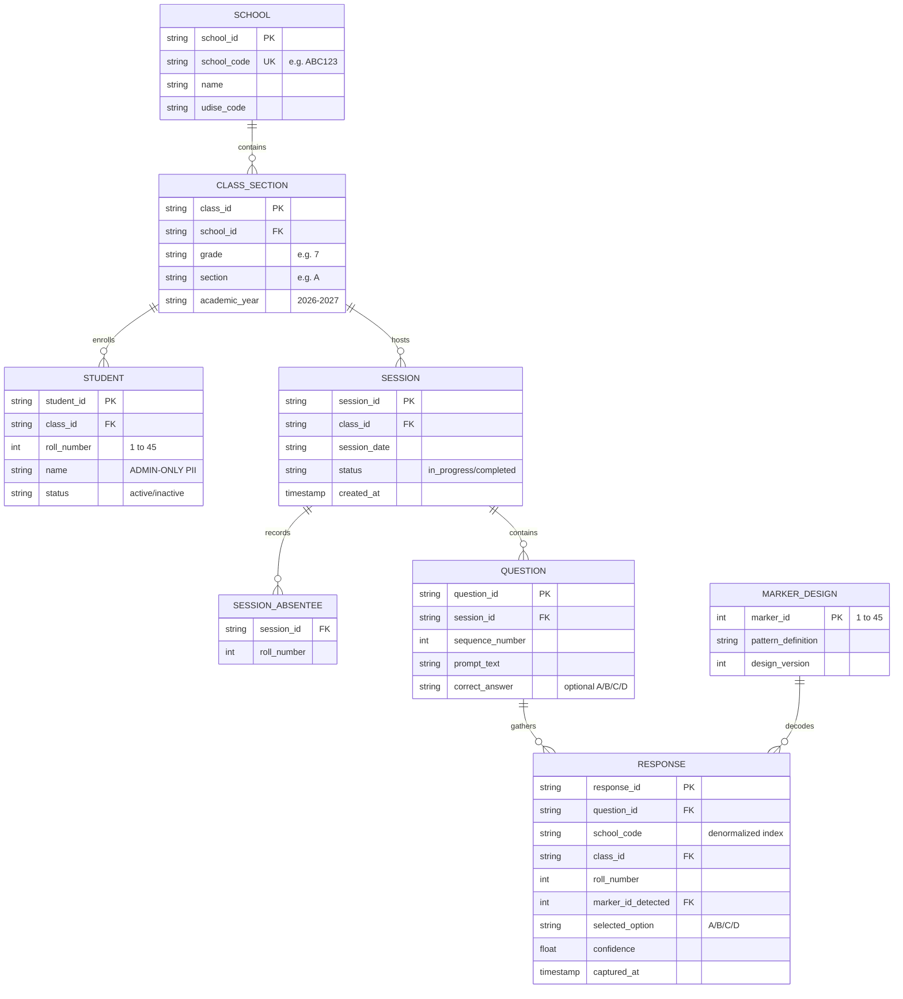
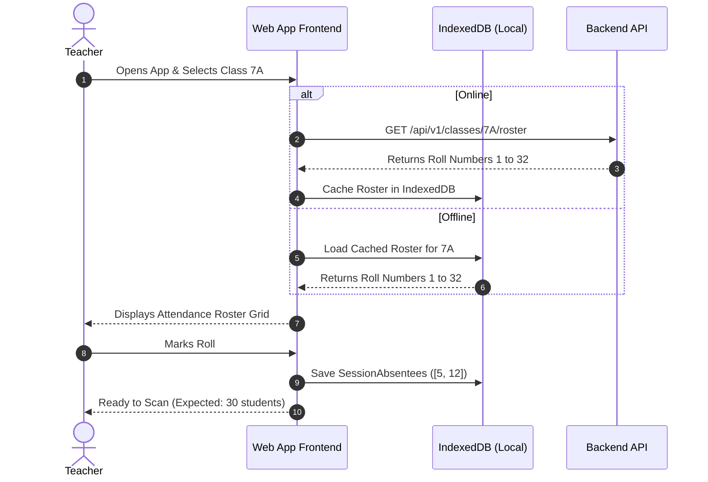

# Web Application Architecture Document — Classroom Marker Assessment System

> **Document Status:** Draft for Review  
> **Audience:** Software Architects, Frontend/Backend Developers, DevOps, and QA Engineers  
> **Related Documents:** [`PRD.md`](file:///c:/Users/Hitansh/ET617/docs/PRD.md), [`DESIGN.md`](file:///c:/Users/Hitansh/ET617/docs/DESIGN.md), [`IMPLEMENTATION.md`](file:///c:/Users/Hitansh/ET617/docs/IMPLEMENTATION.md)

---

## 1. System Overview & Non-Technical Architecture

### 1.1 What the Web Application Does
The **Classroom Marker Assessment System** is a responsive, offline-first Web Application built for teachers in partner schools under the **Pi Jam Foundation**. It enables teachers to conduct real-time multiple-choice assessments (quizzes, polls, comprehension checks) in physical classrooms using any web browser on a smartphone, tablet, or laptop equipped with a camera.

### 1.2 Core Architectural Principles
1. **Zero Student Devices:** Only the teacher operates a single device running the web app. Students hold physical, reusable paper cards (numbered 1 to 45).
2. **Offline-First Resilience:** The app operates completely without an active internet connection during classroom hours. Scanning, decoding, response accumulation, and roster verification run locally in the browser. Data synchronizes when internet becomes available.
3. **Sub-30-Second Classroom Sweeps:** Rather than taking individual photos or scanning cards one by one, the teacher sweeps the camera across the classroom. The computer vision engine tracks and decodes all students simultaneously in a continuous video stream.
4. **Privacy by Design:** Student names and photographs are strictly quarantined in an administrative roster partition. Response records carry only anonymized keys: `School Code` + `Class/Section` + `Roll Number`.

```
┌─────────────────────────────────────────────────────────────────────────────────────────┐
│                                  PHYSICAL CLASSROOM                                     │
│                                                                                         │
│   [Student 1: Card #1 (A)]    [Student 2: Card #2 (C)]    [Student 3: Card #3 (B)] ...  │
│                                           ▲                                             │
│                                           │ Real-time Camera Sweep                      │
└───────────────────────────────────────────┼─────────────────────────────────────────────┘
                                            │
                                            ▼
┌─────────────────────────────────────────────────────────────────────────────────────────┐
│                           TEACHER CLIENT (Browser / PWA)                                │
│                                                                                         │
│  ┌───────────────────────┐   ┌───────────────────────────┐   ┌───────────────────────┐  │
│  │ WebRTC Camera Stream  ├──►│ Computer Vision Engine    ├──►│ Canvas AR HUD Overlay │  │
│  │ (1080p @ 30 FPS)      │   │ (Wasm / OpenCV.js Worker) │   │ (Bounding Boxes/Badges│  │
│  └───────────────────────┘   └─────────────┬─────────────┘   └───────────────────────┘  │
│                                            │                                            │
│                                            ▼                                            │
│                              ┌───────────────────────────┐                              │
│                              │ Session State Machine     │                              │
│                              │ • Confirmed Roll Numbers  │                              │
│                              │ • Real-time Missing List  │                              │
│                              │ • Conflict & Anomaly Trap │                              │
│                              └─────────────┬─────────────┘                              │
│                                            │                                            │
│                                            ▼                                            │
│                              ┌───────────────────────────┐                              │
│                              │ Local Storage (IndexedDB) │                              │
│                              │ (100% Offline Resilience) │                              │
│                              └─────────────┬─────────────┘                              │
└────────────────────────────────────────────┼────────────────────────────────────────────┘
                                             │ Background Sync (When Wi-Fi Available)
                                             ▼
┌─────────────────────────────────────────────────────────────────────────────────────────┐
│                                   BACKEND CLOUD                                         │
│                                                                                         │
│  ┌───────────────────────────────────────────────────────────────────────────────────┐  │
│  │ FastAPI REST & WebSocket Ingestion Service                                        │  │
│  └─────────────────────────────────────────┬─────────────────────────────────────────┘  │
│                                            │                                            │
│                                            ▼                                            │
│  ┌───────────────────────────────────────────────────────────────────────────────────┐  │
│  │ Relational Database (PostgreSQL / SQLite)                                         │  │
│  │  ├── Admin Partition: School, ClassSection, Student Roster (PII Restricted)        │  │
│  │  └── Analytics Partition: Sessions, Questions, Responses (Anonymized Data)        │  │
│  └───────────────────────────────────────────────────────────────────────────────────┘  │
└─────────────────────────────────────────────────────────────────────────────────────────┘
```

---

## 2. Web Application Frontend Architecture (Client Layer)

The frontend is architected as a modern, progressive Single Page Application (SPA) designed to achieve 60 FPS UI performance while performing continuous computer vision calculations.

### 2.1 Technology Stack (Frontend)
- **Core:** HTML5, Modern Vanilla JavaScript (ES6+) for maximum control and zero unnecessary framework overhead.
- **Styling:** Custom CSS Design System with dark mode, glassmorphism cards, and fluid responsive layouts for mobile viewports.
- **Camera Capture:** HTML5 WebRTC MediaDevices API (`navigator.mediaDevices.getUserMedia`).
- **Computer Vision Runtime:** Dual-Pipeline:
  - **Primary:** Client-side WebAssembly (`OpenCV.js`) running inside a background `Web Worker`.
  - **Secondary / Server-Assisted Fallback:** Binary WebSocket stream to a local/network Python backend for devices with limited WebAssembly capabilities.
- **Graphics & Augmented Reality HUD:** HTML5 `<canvas>` rendering engine synchronized with video preview timestamps.
- **Client Offline Storage:** `IndexedDB` with `ServiceWorker` caching for offline PWA operation.

### 2.2 Component Hierarchy

```
AppShell
├── Header / Navigation Bar (Session status, Wi-Fi connectivity indicator)
├── Viewport Router
│   ├── View 1: ClassSelectorView
│   │   ├── SchoolDropdown
│   │   └── ClassSectionGrid
│   ├── View 2: AttendanceView
│   │   ├── RosterCardGrid (Roll 1 to N with student status)
│   │   └── QuickAbsenteeToggle
│   ├── View 3: LiveScannerView (The Core Assessment Screen)
│   │   ├── VideoPreviewContainer (HTML5 <video>)
│   │   ├── ARCanvasOverlay (HTML5 <canvas> for bounding boxes & labels)
│   │   ├── TopProgressBar (Scanned % gauge & Timer)
│   │   ├── FloatingBadgeHUD (Card ID & Answer badges directly over markers)
│   │   ├── MissingRollPills (Real-time chips: "Missing: #4, #12, #19")
│   │   └── ControlToolbar (Lock Question, Flip Camera, Flashlight toggle)
│   └── View 4: QuestionSummaryView
│       ├── DistributionBarChart (Counts for A, B, C, D)
│       ├── DetailedResponseTable (Roll Number -> Answer)
│       └── NextQuestionButton
└── OfflineSyncManager (Background IndexedDB-to-Backend synchronizer)
```

### 2.3 Decoupled Thread Architecture (Preventing Frame Drops)
Running continuous computer vision on a single thread blocks the UI, causing choppy video and unresponsive buttons. The web app strictly separates rendering from compute:

```
[UI / Main Thread]
  ├── Captures video stream from camera (30 FPS)
  ├── Copies video frame to an OffscreenCanvas or ImageBitmap
  ├── Transmits frame buffer to Web Worker via zero-copy postMessage
  ├── Renders animated UI, buttons, and previous frame's AR bounding boxes
  └── Receives detection payload from Worker and updates state

[CV Web Worker Thread]
  ├── Receives raw image data (10–15 FPS governed rate)
  ├── Converts YUV / RGB to Grayscale
  ├── Executes ArUco / Fiducial localization & corner detection
  ├── Calculates card orientation -> Answer (A, B, C, D)
  ├── Samples top-edge color band in HSV
  └── Returns compact JSON array: `[{ id: 14, answer: 'B', box: [...] }]`
```

---

## 3. Backend & API Architecture (Service Layer)

The backend is built with **Python FastAPI** and an async relational ORM, optimized for high-throughput batch response ingestion.

### 3.1 Architecture Diagram

```
                              ┌─────────────────────────────────┐
                              │     Client Request Ingress      │
                              │     (HTTP / REST & WebSocket)   │
                              └────────────────┬────────────────┘
                                               │
                                               ▼
                              ┌─────────────────────────────────┐
                              │     FastAPI Application Router  │
                              └───────┬─────────────────┬───────┘
                                      │                 │
                   ┌──────────────────┴──┐           ┌──┴──────────────────┐
                   ▼                     ▼           ▼                     ▼
          ┌────────────────┐    ┌─────────────┐ ┌──────────────┐   ┌──────────────┐
          │ Roster Service │    │ Session     │ │ Response     │   │ Analytics    │
          │ (Admin / PII)  │    │ Coordinator │ │ Ingestion    │   │ Engine       │
          └────────┬───────┘    └──────┬──────┘ └──────┬───────┘   └──────┬───────┘
                   │                   │               │                  │
                   └───────────────────┼───────────────┼──────────────────┘
                                       ▼               ▼
                              ┌─────────────────────────────────┐
                              │    SQLAlchemy Async Engine      │
                              └────────────────┬────────────────┘
                                               │
                                               ▼
                              ┌─────────────────────────────────┐
                              │   PostgreSQL / SQLite Database  │
                              └─────────────────────────────────┘
```

### 3.2 REST API Specification

| Method | Endpoint | Role | Description |
|---|---|---|---|
| `GET` | `/api/v1/schools` | Teacher / Admin | List available schools. |
| `GET` | `/api/v1/schools/{id}/classes` | Teacher / Admin | List class sections for a school. |
| `GET` | `/api/v1/classes/{id}/roster` | Teacher App | Get active roster roll numbers for scanning. |
| `POST` | `/api/v1/classes/{id}/roster` | Admin Only | Upload or update class roster (requires admin token). |
| `POST` | `/api/v1/sessions` | Teacher | Start a live assessment session. |
| `POST` | `/api/v1/sessions/{id}/absentees` | Teacher | Submit list of marked absentees for the session. |
| `POST` | `/api/v1/sessions/{id}/questions` | Teacher | Create a new question within the active session. |
| `POST` | `/api/v1/questions/{id}/responses` | Teacher App | Commit batch of scanned responses for a question. |
| `POST` | `/api/v1/sessions/{id}/sync` | Teacher App | **Offline Ingestion Endpoint:** Submits an entire locally-completed session with all questions and responses in one atomic transaction. |
| `GET` | `/api/v1/analytics/sessions/{id}` | Analyst | Fetch aggregate response distributions (no PII). |

### 3.3 WebSocket Streaming Endpoint (Server-Assisted CV)
- **Route:** `WS /api/v1/ws/scanner`
- **Protocol:**
  - Client sends: Binary JPEG/PNG frame or raw ArrayBuffer.
  - Server returns: JSON detection message:
    ```json
    {
      "frame_timestamp": 1725275000123,
      "detections": [
        { "card_id": 14, "answer": "B", "confidence": 0.99, "corners": [[120, 80], [210, 85], [205, 175], [115, 170]] },
        { "card_id": 22, "answer": "A", "confidence": 0.96, "corners": [[410, 110], [500, 115], [495, 205], [405, 200]] }
      ],
      "anomalies": []
    }
    ```

---

## 4. Database Schema & Privacy Segregation

The database strictly separates PII (student names) from anonymized assessment responses, matching [`DESIGN.md`](file:///c:/Users/Hitansh/ET617/docs/DESIGN.md).

### 4.1 Entity Relationship Diagram (ERD)



### 4.2 Data Segregation & Security
1. **Zero Student Names in Response Tables:** The `Response` table references only `(school_code, class_id, roll_number)`. Even if an analytics export is leaked, it contains no human names or photos.
2. **Access Control Roles:**
   - **Teacher Role:** Read roster roll numbers, read/write sessions and responses. Cannot export names across schools.
   - **Analyst Role:** Read-only access to `Session`, `Question`, and `Response`. Table-level permissions explicitly deny access to `Student.name`.
   - **Admin Role:** Full access to configure school rosters once per year.

---

## 5. Computer Vision Engine Architecture

```
                                  Input Frame (RGB / YUV)
                                            │
                                            ▼
                           ┌─────────────────────────────────┐
                           │    Luminance & Contrast Pass    │
                           │  • Extract Y-plane (grayscale)  │
                           │  • CLAHE adaptive contrast      │
                           └────────────────┬────────────────┘
                                            │
                                            ▼
                           ┌─────────────────────────────────┐
                           │   Adaptive Thresholding Engine  │
                           │  • Multi-scale windowing        │
                           │  • Polygon contour extraction   │
                           └────────────────┬────────────────┘
                                            │
                                            ▼
                           ┌─────────────────────────────────┐
                           │   Quadrilateral Corner Sorter   │
                           │  • Sub-pixel corner refinement  │
                           │  • Perspective warp to canonical│
                           └────────────────┬────────────────┘
                                            │
                                            ▼
                           ┌─────────────────────────────────┐
                           │    5x5 Bitgrid Binary Decode    │
                           │  • Sample interior 25 cells     │
                           │  • Compute Hamming distances    │
                           │  • Resolve Card ID & Rotation   │
                           └────────────────┬────────────────┘
                                            │
                                            ▼
                           ┌─────────────────────────────────┐
                           │   Secondary HSV Color Sampler   │
                           │  • Sample top-edge color band   │
                           │  • Cross-check against rotation │
                           │  • Discard ambiguous reads      │
                           └────────────────┬────────────────┘
                                            │
                                            ▼
                           Validated: (Card ID, Answer, Box)
```

### 5.1 Orientation & Answer Mathematical Formulation
Let the 4 detected corners of marker $i$ in screen coordinates be:
$$c_0 = (x_0, y_0), \quad c_1 = (x_1, y_1), \quad c_2 = (x_2, y_2), \quad c_3 = (x_3, y_3)$$
representing the marker's canonical Top-Left, Top-Right, Bottom-Right, and Bottom-Left corners.

The 4 edge centers in screen space are:
$$M_A = \frac{c_0 + c_1}{2}, \quad M_B = \frac{c_1 + c_2}{2}, \quad M_C = \frac{c_2 + c_3}{2}, \quad M_D = \frac{c_3 + c_0}{2}$$

Because image coordinate $y$ increases downwards, the edge pointing towards the ceiling has the **minimum $y$ value**:
$$\text{Selected Answer} = \arg\min_{K \in \{A, B, C, D\}} \left( y(M_K) \right)$$

### 5.2 Deadband & Ambiguity Rejection
To prevent flickering when a student holds a card diagonally:
1. Let $M_{(1)}$ and $M_{(2)}$ be the two midpoints with the lowest and second-lowest $y$ coordinates.
2. If $|y(M_{(1)}) - y(M_{(2)})| < \delta_{\text{deadband}}$:
   The card is held at an ambiguous diagonal angle ($\sim 45^\circ$).
   **Status:** `AMBIGUOUS` $\rightarrow$ Rejected from tally; displayed in yellow on screen until stabilized.

---

## 6. End-to-End Sequence Workflows

### 6.1 Workflow 1: Classroom Setup & Attendance Check



### 6.2 Workflow 2: Live Scanning Sweep & AR Feedback

```mermaid
sequenceDiagram
    autonumber
    actor Teacher
    participant Cam as Camera Stream (WebRTC)
    participant App as Web App UI & AR HUD
    participant Worker as CV Web Worker
    participant State as Session State Tracker

    Teacher->>App: Taps "Start Scan" (Question 1)
    App->>Cam: Request Video (1080p, Environment)
    Cam-->>App: Stream 30 FPS Preview
    loop Every Frame (Throttled to 12 FPS)
        App->>Worker: Send Frame Buffer
        Worker->>Worker: Grayscale + ArUco Decode + HSV Check
        Worker-->>App: Detection Results: [{id: 14, ans: 'B'}, {id: 22, ans: 'A'}]
        App->>State: Ingest Detections
        State->>State: Debounce & Update Confirmed / Missing Lists
        App->>App: Render AR Bounding Boxes & Update "Missing: #7, #19"
    end
    Teacher->>App: Sweeps over remaining desks; All 30 detected
    App->>App: Vibrate Device & Play Chime ("100% Scanned")
    Teacher->>App: Taps "Lock Poll"
    App->>App: Displays Question Summary (A: 12, B: 15, C: 3, D: 0)
```

### 6.3 Workflow 3: Offline Storage & Background Sync

```mermaid
sequenceDiagram
    autonumber
    participant App as Web App Frontend
    participant IDB as Local IndexedDB
    participant SW as Service Worker
    participant API as Backend API

    App->>IDB: Save Responses atomically for Question 1
    Note over App,IDB: Instant (< 2ms), Zero Network Dependency
    Teacher->>App: Completes class; Closes laptop/phone
    Note over SW: Later in Staff Room: Wi-Fi Reconnected
    SW->>SW: Detect 'online' Event / Periodic Background Sync
    SW->>IDB: Fetch pending unsynced sessions
    IDB-->>SW: Return Session Payload (JSON < 15KB)
    SW->>API: POST /api/v1/sessions/{id}/sync
    API->>API: Bulk insert into Database (Transaction)
    API-->>SW: HTTP 200 OK (Sync Acknowledged)
    SW->>IDB: Mark Session as 'SYNCED'
    SW-->>App: Show Notification: "All sessions backed up"
```

---

## 7. Technology Evaluation & Key Architectural Trade-Offs

| Decision Area | Chosen Approach | Rejected Alternative | Technical Rationale |
|---|---|---|---|
| **App Architecture** | **Progressive Web App (PWA)** | Native Mobile App (Android/iOS) | No app store installs; runs immediately on any teacher's phone, school laptop, or Chromebook. Zero deployment barriers in Indian government schools. |
| **CV Execution** | **Client-Side OpenCV.js in Web Worker** | Pure Server-Side Streaming | Eliminates massive server bandwidth costs; works 100% offline in classrooms without connectivity. |
| **Marker System** | **Open ArUco 5x5 Grid** | Proprietary Plickers Clone | Free from proprietary patent encumbrance; open standard, highly optimized in OpenCV. |
| **Identity Resolution** | **`Roll Number == Marker ID` scoped by `Class ID`** | Permanent physical card-to-student assignment | Cards are completely reusable across periods and classes. Zero per-student printing overhead. |
| **Local Storage** | **Browser IndexedDB** | LocalStorage / Cookies | IndexedDB supports structured asynchronous object storage capable of storing months of offline assessment logs safely without storage limits. |
